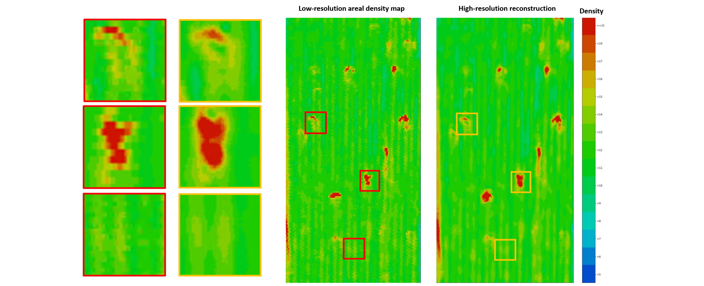

# Abstract

In this work, we develop methods for single image super-resolution where large data sets are not available and the unknown compressive models are diverse and complex. We develop and demonstrate techniques for combining classic sparse representations with modern ideas in deep neural networks, such as neural network ensembles, to improve the performance of image super-resolution. Classic image super-resolution deep networks are often studied using a large amount of training data and simple or fixed compressive models. However, in applications with limited training data, their performance tends to be unstable. Herein, we use transform domains, in particular wavelet domains, where images can be represented sparsely to generate a robust model accommodating small training data and diverse compressive models. Our model leverages an ensemble of image super-resolution networks to provide stable high quality reconstruction results. In particular, we report here a successful application of our model to improve the resolution of areal density maps of Miralon sheets generated by a Mahlo QMS-12 Qualiscan Beta Transmission System. Our model can reveal finer details in the material texture from a small training data set, helping to improve the detection of manufacturing defects and improving the quality control capabilities for Miralon sheet production.  

# Architecture

The architecture for the ensemble method in both the space domain and the wavelet transform domain. Two algorithms are performed on the space representation and the multi-channel wavelet representation separately. Then the outcomes are combined by element-wise addition. Finally, the output is refined by an extra convolutional layer.

# Result

Reconstructed beta transmission areal density maps by the proposed algorithm for Miralon sheets from the production line. Details for uneven density distribution are recovered.

### train and test on ordinary images
Training and testing sample Jupyter notebook see sample_notebook.ipynb

Down load DIV2K images from https://data.vision.ee.ethz.ch/cvl/DIV2K/
